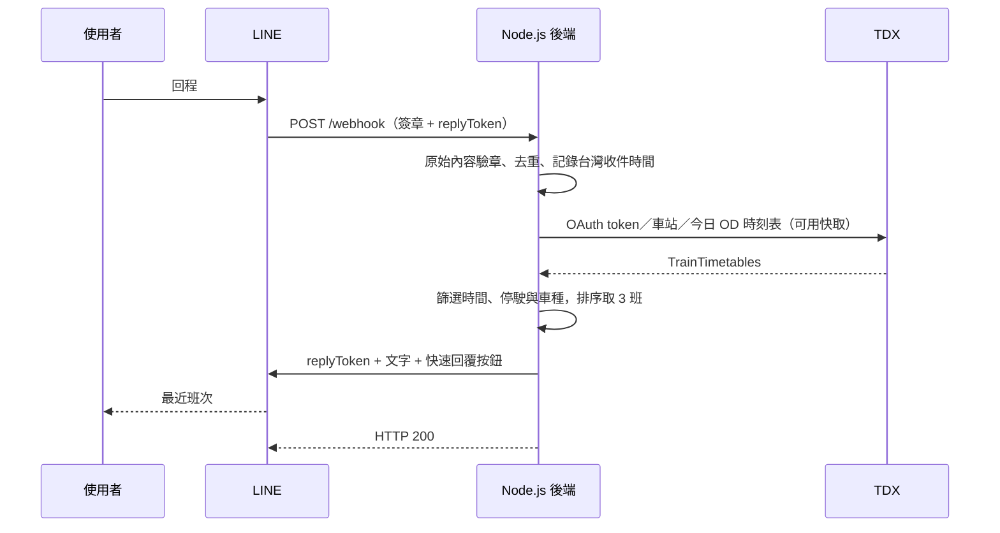

# LINE 台鐵通勤 Bot

在 LINE 輸入「去程」或「回程」，查詢今天、目前時間之後的最近 3 班台鐵。也可直接輸入「新左營到路竹」或「火車 新左營 路竹」，不必事先設定其他路線。

列表只顯示最近三班、日期與現在時間。點 **1／2／3** 顯示車次、上車站與預估抵達時間，附「搭上了／沒搭上」按鈕；沒搭上會沿用所選行程的起訖站查下一班。**選車後開始雲端誤點追蹤**：超過 4 分鐘、超過 9 分鐘各通知一次，到預計抵達時間停止；「沒搭上」改追下一班，「停止追蹤」可取消。訊息採用純文字；群組按「知道」會標記點擊者並顯示「已確認收到」。沒有說明按鈕，但仍可手動輸入「說明」。

數字選擇以你最近收到的列表為準，按鈕則綁定原本的列表。列表有效 30 分鐘，換日請重新查詢；Cloudflare Durable Object 會保存有效的列表與選車狀態，重啟後仍可繼續。**只接受完整指令或完整路線格式**，不接受「我想搭回程」「回程選擇1」等句子。群組所有成員都能查詢及操作，並共用該群組的行程；不同群組及私訊仍隔離。

**自己改文案：** 在 VS Code 編輯 `copy.zh-TW.json`，Ctrl + S 儲存後，下一則回覆立即使用新版。詳細步驟見 [文案修改教學](文案修改教學.md)。格式錯誤時保留上一版，不中斷服務。

| 指令 | 預設路線 |
| --- | --- |
| 去程 | 大湖 → 新左營 |
| 回程 | 新左營 → 大湖 |
| 其他路線 | 顯示其他路線查詢說明，不清除目前選擇 |
| 新左營到路竹 | 直接查指定路線，任意 TDX 台鐵中文站名皆可 |
| 火車 台南 新左營 | 另一種完整查詢格式 |
| 說明 | 顯示操作方式 |

此處的大湖是 **高雄市路竹區的台鐵大湖車站**，不是苗栗大湖；可核對 [台鐵官方大湖站資訊](https://www.railway.gov.tw/tra-tip-web/tip/tip00H/tipH41/viewStaInfo/4290)。正式查詢仍由 TDX v3 依站名查找車站代碼，示範與測試才使用固定代碼。


## 按鈕與雲端誤點追蹤

| 階段 | 按鈕（依序） |
| --- | --- |
| 開始／查詢說明 | 去程／回程／其他路線 |
| 查到三班 | 1／2／3／去程／回程／其他路線 |
| 選定車 | 知道／搭上了／沒搭上／停止追蹤 |
| 搭上了 | 知道／停止追蹤 |
| 沒搭上 | 知道／去程／回程／其他路線／停止追蹤 |
| 知道 | 追蹤中只附「取消追蹤」；已停止或到期時不附按鈕 |

- 每個群組共用一個行程；每個私訊獨立。任何群組成員可操作，選另一班就換追另一班。數字對應群組最近一次列表；按鈕仍綁定原班次。
- 選定班次即建立追蹤，回覆加入「已開始追蹤列車狀態」文案；沒搭上後成功改追下一班也會提示。若距出發超過 30 分鐘，先等到出發前 30 分鐘再查即時資料；之後約每分鐘檢查。沒有有效追蹤時不排程。
- 誤點嚴格大於 4／9 分鐘才通知（整數資料即 5／10 分鐘），各一次。第一次取得資料已超過兩門檻時，兩個門檻通知會依序發出；恢復後再次超過不重複。同一仍在追蹤的車次重選會保留通知紀錄。
- 按「沒搭上」即停止舊車追蹤，成功查到下一班且 LINE 回覆成功後開始新追蹤。沒下一班或查詢失敗時不再追舊車；可重新查詢。
- 按「停止追蹤」或完整輸入同名指令立即取消。舊車停止按鈕不能取消新車。「知道」只確認閱讀，不停止，會保留綁定目前班次的「取消追蹤」按鈕；完整輸入「取消追蹤」也能停止。
- 預估抵達時間依表訂加最新可用誤點；資料缺少或過期不代表準點，維持最後有效 ETA（從未取得即時資料則採表訂）。抵達時再確認一次最新資料；有新延誤則延期，確認已到站或到 ETA 即結束，不再發送。這不是實際到站保證。
- 使用 Durable Object alarm 與持久快照，Worker 重啟仍可追蹤。推播前持久保存 LINE retry key 及內容，網路錯誤以相同 key 重試，避免重複通知。
- LINE Push 使用訊息額度；TDX 查詢及 Cloudflare 使用量依帳號方案計算。本次未開通或升級付費方案。
- 已移除群組管理者限制；Cloudflare 原有 GROUP_CONTROLLER_USER_ID Secret 不再讀取。為避免混用舊使用者專屬列表，本版首次部署後需重新傳「去程／回程／其他路線」。
- 原有本機 Node.js 入口仍可測試查詢，但自動追蹤的排程僅在 Workers 啟用。修改文案後需重新部署。

主要程式：src/tracking.mjs 的 DelayTracker.start/stop/poll 處理追蹤；src/worker.mjs 的 BotState.alarm/persist 將排程與快照一起儲存；src/line.mjs 的 push 沿用 runtimeFetch 與 redirect: manual。

### 其他路線與共用架構

- `parseRouteQuery()` 解析完整「起點到終點」或「火車 起點 終點」格式；接受「到」前後空白與全形空白。
- `TrainService.lookup(route, instant, options)` 是去程、回程、其他路線的共用入口。相同起訖站在呼叫 TDX 前即拒絕。
- `TdxClient.resolveStations()` 沿用 TDX v3 Station 清單，建立中文站名索引並快取 24 小時；「台／臺」與單一「站／車站／火車站」尾綴沿用既有正規化。錯字如「路竹站站」會回覆原始錯誤站名，不會一再移除「站」直到碰巧符合。
- 選車狀態沿用 `SelectionStore`、`JourneyChoices` 與 Durable Object 快照。其他路線的「沒搭上」使用保存的起訖站，不會回退成去程／回程。
- 查無班次會回覆路線提示並清除最新數字選擇。舊按鈕仍遵循原有使用者、聊天室與到期檢查。
- 新文案位於 `copy.zh-TW.json`：`otherRoutesHelp`、`noRouteTrains`、`unknownStation`、`sameStation`、`boardedOtherRoute`、`buttonOtherRoutes`。

Cloudflare 入口維持 `src/worker.mjs`；`runtimeFetch()`、`redirect: 'manual'` 與 Secrets 讀取方式沒有改動。Cloudflare 上修改文案後需要重新部署；以下本機 Node.js／ngrok 說明只適用於本機執行模式。

使用 **Node.js 24、LINE Messaging API、TDX Rail/TRA v3**。Workers 以 Durable Object SQLite 保存短期行程與通知狀態；不需要另架網站。

> 此電腦於 2026-08-29 已完成 LINE Token、TDX 真實班表、公開 HTTPS 與 LINE 官方 Webhook 簽章驗證；使用者已確認去回程查詢能正常回覆。新增到達時間功能後，已通過真實 TDX 查詢與 LINE 官方訊息格式驗證，並重啟服務。請重新傳「回程」取得新版列表，再選擇班次。`demo` 是假資料示範，正式後端不會自動改用假資料。換電腦或新專案時仍須自行設定 `.env`，不要公開或提交金鑰。

## 1. 在 VS Code 開啟

使用 VS Code 的「檔案 → 開啟資料夾」選擇本專案，或開啟 `line-tra-bot.code-workspace`。

此電腦另有 `line-tra-bot.local.code-workspace`。兩個 workspace 與直接開啟資料夾都共用 `.vscode/launch.json`、`.vscode/tasks.json`，已指定這台電腦可用的 Node.js，不需要從 PATH 尋找 `node`。在「執行與偵錯」選擇 **本機：離線示範**，按 F5 就能先看到效果。

換到其他電腦時，安裝 [Node.js 24 LTS](https://nodejs.org/en/download)，重新開啟 VS Code。終端機輸入 `node --version` 應顯示 `v24.x` 或更新的相容版本。再將 `.vscode/launch.json` 的三個 `runtimeExecutable` 與 `.vscode/tasks.json` 的 `command` 改成新電腦的 Node 執行檔路徑，或在 PATH 正常時改成 `node`。

## 2. 不用金鑰，先跑示範及測試

在 VS Code 終端機、專案根目錄執行：

```powershell
node scripts/demo.mjs
node --test
```

若此電腦找不到 `node`，可以用專案附的 PowerShell 腳本；它會先找已安裝的 Node，再找此電腦的內建執行環境：

```powershell
.\run.ps1 demo
.\run.ps1 test
```

若 PowerShell 的執行原則不允許腳本，使用上述本機 VS Code workspace 的偵錯設定即可，不需要更動系統執行原則。

示範會清楚標示「人工假資料」，顯示以下內容：

```text
🚆 新左營 → 大湖

最近班次
① 17:48　區間車 3238
② 18:02　區間車 3242
③ 18:16　區間快 3018

查詢日期：2026-08-28
現在時間：17:42（台灣時間）
時刻表資料，非即時誤點；請以車站公告為準。
```

**上述車次及時間只是功能示範，不能用來安排實際搭車。**

## 3. 設定四項憑證

複製 `.env.example` 成 `.env`；如果 `.env` 已存在，不要覆蓋原本的設定。

```powershell
Copy-Item .env.example .env
```

在 VS Code 編輯 `.env`：

```dotenv
LINE_CHANNEL_SECRET=你的ChannelSecret
LINE_CHANNEL_ACCESS_TOKEN=你的ChannelAccessToken
TDX_CLIENT_ID=你的ClientID
TDX_CLIENT_SECRET=你的ClientSecret
```

值的前後不要額外加空格。不要將真實憑證貼到聊天、放進截圖或提交 Git；專案的 `.gitignore` 已忽略 `.env`。

### LINE 憑證從哪裡拿

1. 在 [LINE Official Account Manager](https://manager.line.biz/) 建立或使用既有官方帳號。
2. 在官方帳號的設定中啟用 Messaging API，選擇正確的 Provider。
3. 到 [LINE Developers Console](https://developers.line.biz/console/)，選取該 Messaging API Channel。
4. 在 **Basic settings** 取得 Channel secret。
5. 在 **Messaging API** 頁籤取得／發行 Channel access token。個人測試可使用 long-lived token，並妥善保管。

Messaging API Channel 現行建立流程是先有官方帳號、再啟用 API；不是直接在 Developers Console 新建 Messaging API Channel。見 [LINE 官方建立步驟](https://developers.line.biz/en/docs/messaging-api/getting-started/)。

### TDX 憑證從哪裡拿

到 [TDX 運輸資料流通服務](https://tdx.transportdata.tw/) 註冊、完成帳號流程後，在會員中心取得 API 金鑰中的 Client ID、Client Secret，確認帳號可使用所需基礎服務。存取額度與限制依帳號方案為準；本專案不會替你訂閱付費方案。參考 [TDX 官方認證範例](https://github.com/tdxmotc/SampleCode)。

## 4. 先驗證 TDX 真實查詢

只需要填好 TDX 兩項憑證，不需要 LINE Webhook：

```powershell
node scripts/query.mjs 回程
node scripts/query.mjs 去程
```

或使用 `.\run.ps1 query 回程`。這會實際呼叫 TDX、使用當下台灣時間，但不會傳送 LINE 訊息。正常顯示當天班次或查無班次後，再接 LINE。

如果 TDX 回傳驗證錯誤，請檢查憑證與服務權限；若為 429，請等待流量限制解除。程式不會把上游錯誤內容或金鑰印出。

## 5. 啟動後端

```powershell
node src/server.mjs
```

或使用 `.\run.ps1 start`／VS Code 的 F5「啟動後端」。這個程式需要保持執行，關閉終端機就會停止服務。

在瀏覽器開啟 [本機健康檢查](http://127.0.0.1:3000/health)，應看到：

```json
{"ok":true,"service":"line-tra-bot"}
```

`/health` 只代表 HTTP 伺服器活著，**不代表 LINE／TDX 憑證已驗證成功**。後端不會提供 `.env`、原始碼或公開查詢代理。

## 6. 接上 LINE Webhook

LINE 需要外部可連線的 **HTTPS** 網址，`localhost` 不能直接填入 LINE。

### 此電腦的 ngrok 啟動準備

Microsoft Store 版 ngrok 已安裝。`.env` 的 `NGROK_AUTHTOKEN` 只需填 Your Authtoken 的金鑰，不要貼整段 `ngrok config add-authtoken` 指令。一般 ngrok CLI 不會自動讀取專案 `.env`；本專案新增的 `scripts/share.mjs` 才會讀取並傳入 ngrok 的環境變數。

**公開連線的資料範圍與授權**：ngrok 會提供公開 HTTPS 網址，將收到的 LINE Webhook 轉送到本機 `127.0.0.1:3000`。Webhook 可能包含訊息內容、使用者識別碼、時間戳記與 `replyToken`，因此這些資料會經過 ngrok 的第三方伺服器。使用者已於 2026-08-29 明確同意此資料轉送範圍；依授權啟動成功後，已完成外部連線及 LINE 官方 Verify 驗證。

啟動入口已備妥：VS Code「本機：後端＋ngrok（公開 Webhook）」會一併管理後端與 ngrok；預設第一個偵錯選項仍是離線示範。`scripts/share.mjs --check` 只檢查本機設定，不建立連線；公開啟動需明確指定 `--confirm-public-webhook`。執行環境的授權仍須另外通過，不可用此參數繞過拒絕。

`ngrok.local.yml` 不放金鑰，關閉 agent 的 HTTP introspection（啟動參數）與本機管理介面。啟動工具不把 LINE／TDX 金鑰交給 ngrok 子行程，也不輸出原始 ngrok 錯誤；僅顯示公開網址與安全錯誤碼。這些措施不代表 ngrok 平台不會處理轉送資料。按 Ctrl+C 會關閉這個啟動工具管理的後端與 ngrok；電腦休眠／關機也會中斷服務。

以下為完成公開連線授權後的設定流程。

本機試用可透過 HTTPS tunnel 轉送到 `http://127.0.0.1:3000`；例如已安裝並設定 [ngrok HTTP tunnel](https://ngrok.com/docs/universal-gateway/http) 時：

```powershell
ngrok http 3000
```

這個動作會把本機服務公開，請只在了解上述資料範圍、完成授權及 ngrok CLI 認證後執行。此電腦目前已由 `share.mjs` 同時啟動後端及 tunnel，不要再開第二個實例；日後程式停止或重開機後，可在 VS Code 選「本機：後端＋ngrok（公開 Webhook）」啟動。

本次已儲存並驗證的 Webhook：`https://kettle-calcium-elevating.ngrok-free.dev/webhook`。重新啟動後請以程式顯示的 `PUBLIC_WEBHOOK` 為準；若網址不同，需更新 LINE 設定並再 Verify。手機可搜尋官方帳號 ID `@232ekcrn`，或掃描 Messaging API 頁面的 QR code 加好友。

拿到網址後，例如 `https://你的公開網域`：

1. LINE Developers → Messaging API → Webhook settings。
2. Webhook URL 填 `https://你的公開網域/webhook`。
3. 點 **Verify**，應顯示成功。測試的空 `events` 會回 HTTP 200。
4. 啟用 **Use webhook**；可再啟用 **Webhook redelivery**。
5. 在官方帳號管理後台關閉不需要的自動回應訊息；若啟用本程式的加入好友歡迎訊息，也關閉重複的後台歡迎訊息。
6. 加入你的官方帳號好友，在 LINE 傳「回程」。

Verify 通過只驗證 Webhook 收件與簽章，不會驗證 TDX，也不會真正送出回覆；一定要再用 LINE 傳指令實測。相關設定見 [LINE 建立 Bot](https://developers.line.biz/en/docs/messaging-api/building-bot/)。

### 長期部署

目前建議使用 Cloudflare Workers，入口為 `src/worker.mjs`，聊天室短期狀態由 Durable Object 保存。部署設定在 `wrangler.jsonc`，詳細步驟請看 `雲端部署說明.md`。LINE 與 TDX 四項金鑰必須設定為 Cloudflare Secrets，不能寫入 Git 或 `wrangler.jsonc`。

Cloudflare Workers 部署指令：

```powershell
npm install
npm test
npm run deploy:worker
```

以下為傳統 Node.js／Render 備用部署方式：

可放到支援長駐 Node.js 的主機；設定四項 API 環境變數、`HOST=0.0.0.0`、平台指定的 `PORT`，啟動指令為 `node src/server.mjs`。由平台或反向代理處理 HTTPS，健康檢查路徑設 `/health`。群組控制者限制已移除；舊 `GROUP_CONTROLLER_USER_ID` 設定會忽略。背景追蹤依賴 Workers Durable Object alarms，本機 Node.js 入口不提供排程。

不要將 `.env` 加入部署映像檔。Docker 範例：

```powershell
docker build -t line-tra-bot .
docker run --rm --env-file .env -e HOST=0.0.0.0 -e PORT=3000 -p 127.0.0.1:3000:3000 line-tra-bot
```

Docker 映像已排除 `.env`，並使用非 root 使用者。此 Docker 設定未在本次環境實際建置；正式部署前請另行驗證。HTTP 3000 埠需透過 HTTPS 反向代理或 tunnel 才能接 LINE。

## 自訂路線與查詢條件

修改 `.env` 後重新啟動後端。

```dotenv
OUTBOUND_FROM=大湖
OUTBOUND_TO=新左營
RETURN_FROM=新左營
RETURN_TO=大湖
RESULT_LIMIT=3
MIN_LEAD_MINUTES=0
TRAIN_TYPE_CODES=
```

車站以 **TDX v3 `/Station` 的站名** 查找 ID，不需要猜測或硬寫車站代碼。可接受「台／臺」及站名後面的「站／車站／火車站」。台鐵「新左營」不要填成台鐵另一個站「左營」。所有使用者共用這份路線設定；目前沒有每人個別路線。

| 設定 | 用途 |
| --- | --- |
| `RESULT_LIMIT=3` | 最近 3 班，可設 1～10 |
| `MIN_LEAD_MINUTES=5` | 只看現在 5 分鐘之後，可設 0～120 |
| `TRAIN_TYPE_CODES=6,10` | 只看區間、區間快；留白看所有一般旅客列車 |
| `TIMETABLE_CACHE_SECONDS=60` | 同日期、同方向班表快取 60 秒，可設 0～300 |
| `TDX_QUERY_TIMEOUT_MS=8000` | 每次查詢總時間預算 8 秒 |
| `LINE_REPLY_TIMEOUT_MS=4000` | LINE 回覆時間上限 4 秒 |

## 運作方式



API 串接依據為 [TDX 官方軌道 v3 Swagger](https://tdx.transportdata.tw/api-service/swagger/basic/5fa88b0c-120b-43f1-b188-c379ddb2593d) 與 [LINE 回覆 API](https://developers.line.biz/en/reference/messaging-api/#send-reply-message)。

### 重要行為與限制

- **時間**：固定 `Asia/Taipei`；以伺服器收到當次 Webhook 的時間為準，重送時不使用舊事件的 `timestamp`。嚴格「現在之後」，17:42:30 不列 17:42:00 的班次。
- **日期**：每次重新計算台灣當日，班表快取也包含日期。只讀當日 OD 回傳的營運日資料，不自動補隔日早班；24:xx 以上離站時間不混入今日。跨午夜列車是否納入當日 OD，依 TDX 回傳的營運日定義；本版未另外合併前一營運日的跨夜列車。
- **班表**：先讀完整分頁，再排序及取前 N 班，避免漏掉晚上的列車。排除停駛、部分停駛、起迄站停駛、郵輪及專列。部分停駛採保守排除，可能略過仍可搭乘的區段。
- **即時資訊**：列表取自表訂時刻；選車或查下一班時，接近乘車時間才讀取一次 TDX TrainLiveBoard（同車次短暫快取）。預估抵達＝表訂到達＋目前誤點，不是官方 ETA 預測；無可用資料時用表訂。Workers 在有效追蹤期間每約一分鐘更新，超過 4、9 分鐘各通知一次。未串接票價、訂票、座位及月台。
- **失敗**：TDX timeout／錯誤會回覆提示，不會假裝查無班次或改用示範資料。LINE 回覆失敗則 Webhook 回非 2xx，啟用 redelivery 後 LINE 可重送。
- **安全**：`x-line-signature` 使用 Channel secret 對原始 body 做 HMAC-SHA256，再以固定時間比較；先驗章再解析 JSON。不記錄使用者 ID、訊息全文、replyToken 或金鑰。見 [LINE 驗章規範](https://developers.line.biz/en/docs/messaging-api/verify-webhook-signature/)。
- **事件去重**：傳統 Node.js 版本在記憶體保留 24 小時、最多 10,000 事件；Cloudflare Workers 版本則將摘要狀態保存於各聊天室的 Durable Object。
- **班次選擇**：列表有效 30 分鐘且換日失效。傳統 Node.js 版本暫存在單一程序記憶體；Workers 版本由 Durable Object 持久保存，並以隨機 HMAC 鹽值隔離使用者與聊天室。到達時間取自目的站 ArrivalTime；跨日顯示次日日期，並非即時誤點預測。
- **處理模式**：查詢與回覆完成才回 HTTP 200，最多同時處理 8 個事件；同一使用者／聊天室依序處理。沒有背景排程、推播或持久化佇列。
- **選擇與隱私**：選車只保留 30 分鐘，使用者識別以每次啟動重新產生密鑰的 HMAC 摘要隔離。沒有 Push 收件者，也不將使用者識別碼、訊息或金鑰寫入日誌。
- **費用與可靠性**：不呼叫 LINE Push、不自動購買額度或升級方案。TDX 查詢仍使用 API 用量。Cloudflare Workers 部署完成並切換 Webhook 後，電腦關機仍可使用；部署前保留 Render 作為回復入口。

## 檔案導覽

| 檔案 | 負責內容 |
| --- | --- |
| `src/server.mjs` | 載入設定、組裝服務、啟動與關閉 |
| `src/app.mjs` | HTTP Webhook、驗章、狀態碼、健康檢查 |
| `src/bot.mjs` | 指令處理、事件去重、查詢錯誤提示 |
| `src/selections.mjs` | 班次列表快取、數字與按鈕選擇、使用者隔離 |
| `src/tdx.mjs` | OAuth、401 更新、車站與時刻分頁、快取 |
| `src/trains.mjs` | 台灣時間、篩選、排序 |
| `src/line.mjs` | Webhook 簽章、replyToken 回覆 |
| `src/messages.mjs` | 中文訊息與 quick reply |
| `copy.zh-TW.json` | 可直接編輯、儲存即生效的文案 |
| `src/copy.mjs` | 文案格式檢查、變數與有效版本保留 |
| `src/realtime.mjs` | 即時誤點、資料新鮮度、估計到達 |
| `src/journeys.mjs` | 暫存已選班次、聊天室隔離、沒搭上與到期清理 |
| `src/config.mjs` | `.env` 讀取與設定檢查 |
| `test/*.test.mjs` | 單元測試及 HTTP 串接測試 |
| `scripts/demo.mjs` | 不需憑證的假資料示範 |
| `scripts/query.mjs` | 只連 TDX 的真實查詢 |

## 常見問題

**VS Code 找不到 Node.js 二進位檔 `node`**：本專案已統一使用 `.vscode/launch.json` 的明確執行檔路徑。關閉錯誤視窗，在「執行與偵錯」重新選擇「本機：離線示範」再按 F5；若仍看到舊選項，先儲存編輯中的檔案，再執行命令面板的 `Developer: Reload Window`。這不會替系統安裝 Node，也不會修改系統 PATH。

**Verify 失敗**：確認後端正在執行、HTTPS 網址正確、路徑是 `/webhook`，Channel secret 屬於同一個 Channel；反向代理不要修改 body。

**Verify 成功但沒回覆**：確認 Use webhook 已啟用、Channel access token 正確、TDX 兩項憑證可用；查看終端機的安全錯誤碼。先執行 `query` 可以隔離 TDX 問題。

**回了兩次**：檢查官方帳號後台自動回應／歡迎訊息；也確認沒有同時開多個本專案實例。

**查無班次**：可能已過末班、套用車種／預留時間條件，或當日資料未提供；不是即時營運保證，請另查台鐵官方。

**PORT 被占用**：關閉之前的後端，或修改 `.env` 的 `PORT`，並同步修改 tunnel 的轉送埠。

**測試範圍**：`node --test` 涵蓋完整簽章 Webhook、去回程及其他路線、所有階段按鈕、群組共用與聊天室隔離、4/9 分鐘邊界、沒搭上換班、到站／停止清理、Durable Object 重啟和 LINE 重試去重。上游使用人工資料；不是實際列車誤點驗證。
